# 0. 说明
上传了 targer 目录（编译文件），方便查看添加注解后生成文件的代码（idea反编译）
# 1. @Getter/@Setter
## 1.1 可用于成员变量上
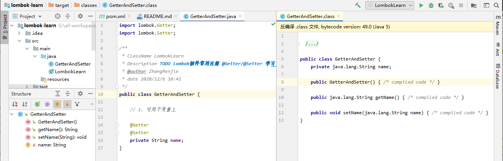
### 1.1.1 可选择生成方法的修饰符
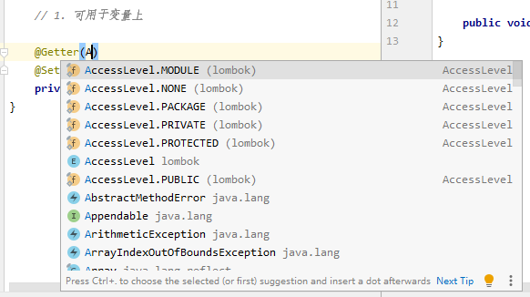
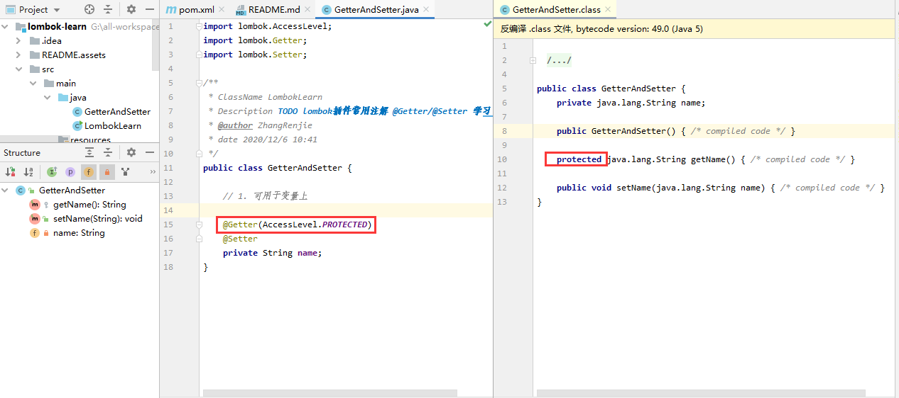

## 1.2 可用于类上
所有成员变量都生成相应方法
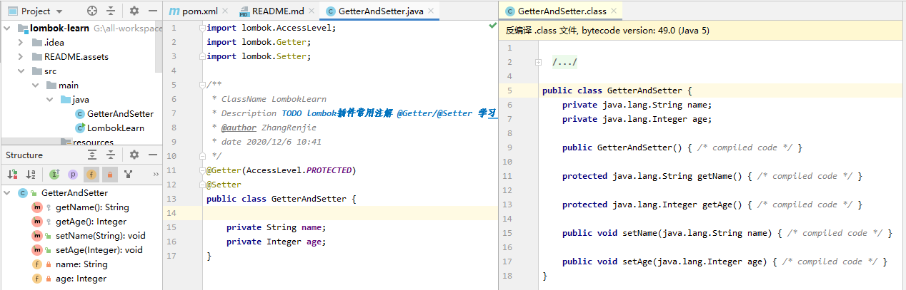
### 1.2.1 静态变量不会生成相应方法
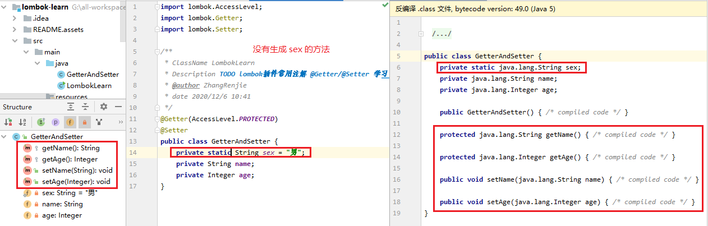
### 1.2.2 常量不会生成 Setter 方法
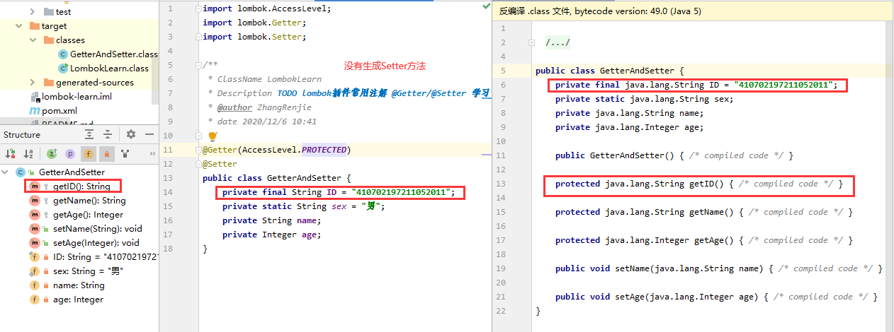
### 1.2.3 单独设置某个变量不可查看（同1.1）
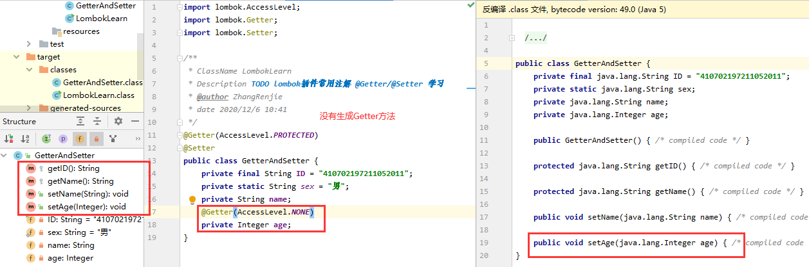

# 2. @ToString
用于类上，为类生成 toString() 方法
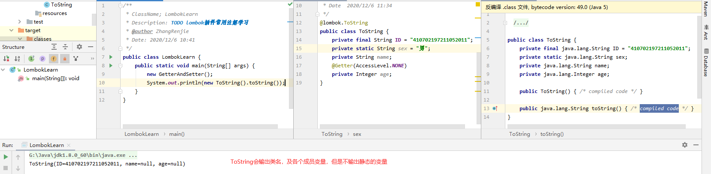
## 2.1 排除某些成员变量
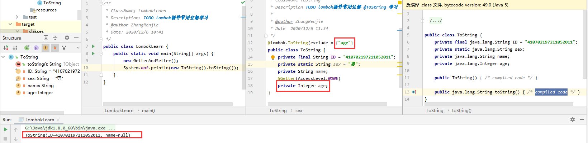
## 2.3 输出指定变量
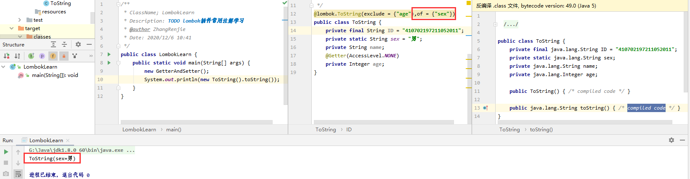

# 3. @EqualsAndHashCode
## 3.1 生成 equals、canEqual、hashCode
equals 可以比较两个对象是否相同（默认比较所有值）
canEqual 比较两个对象是否是同一个对象的实例
hashCode 生成当前对象的 hashCode 码
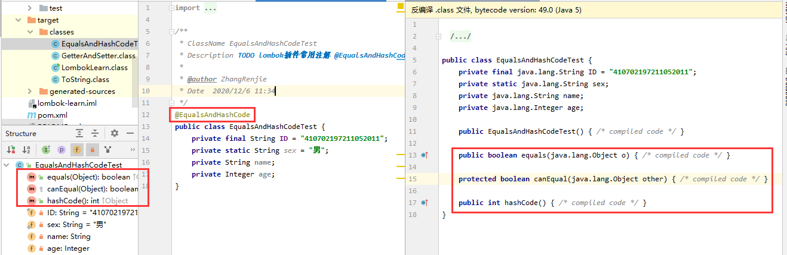
## 3.2 可排除 equals 比较的对象
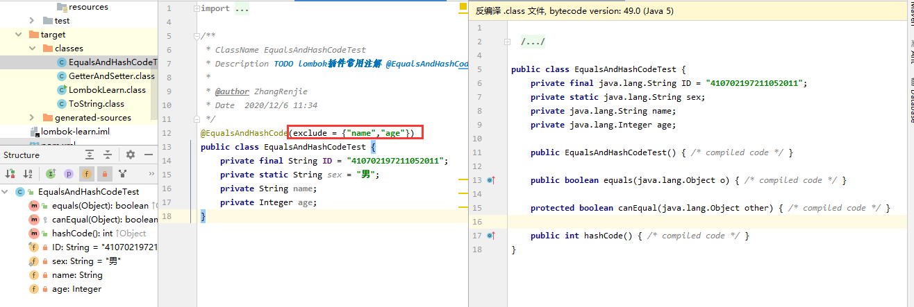
## 3.3 直接指定 equals 比较字段
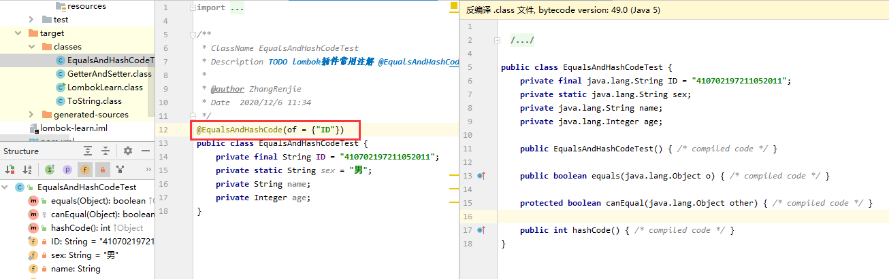

# 4. @NonNull
## 4.1 设置参数不为 null
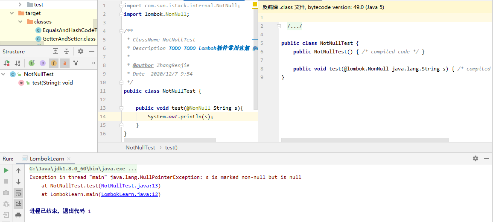

# 5. @NoArgsConstructor
## 5.1 添加无参构造函数
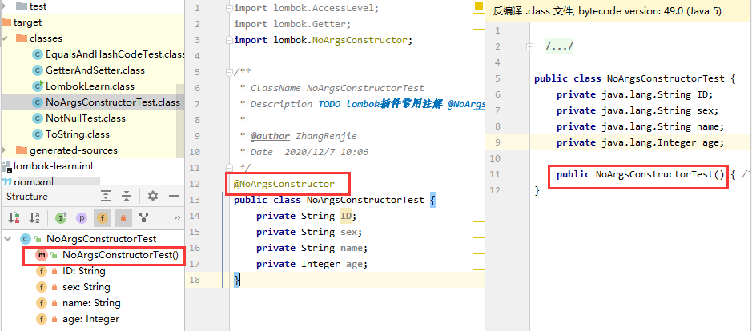
## 5.2 指定参数构造函数
没有初始值的常量(final)、和有@NonNull 的变量是必须要初始化的参数 
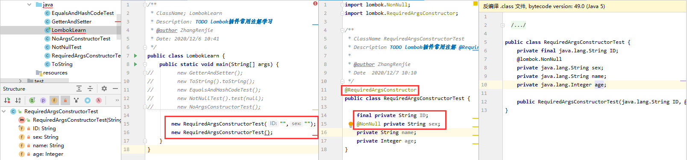
# 6. @AllArgsConstructor
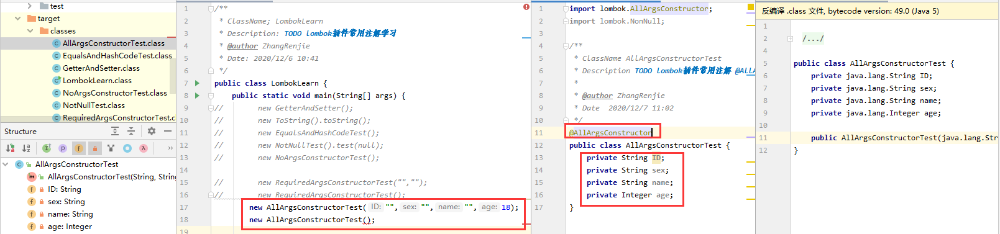
# 7. @Data
集成了Getter、Setter、RequiredArgsConstructor、ToString、EqualsAndHashCode、Value注解
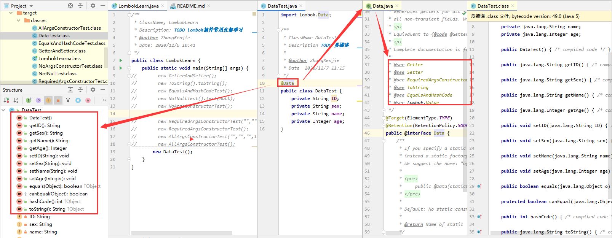

# 8. @Builder
## 8.1 用于链式编程
会生成静态方法 builder，和一个内部类BuilderTestBuilder，内部类中有各个参数对应的赋值方法
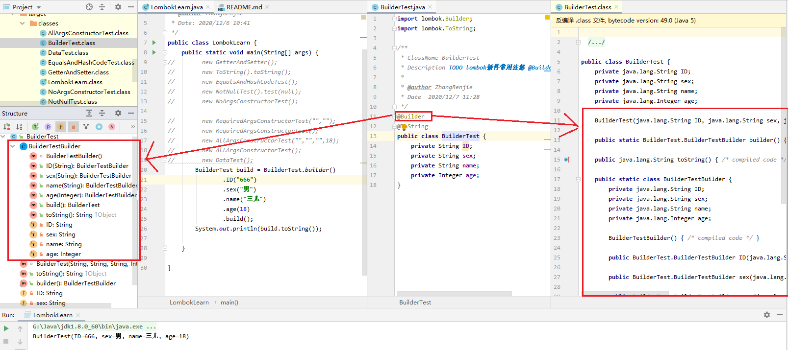

# 9. @Log
## 9.1 输出日志
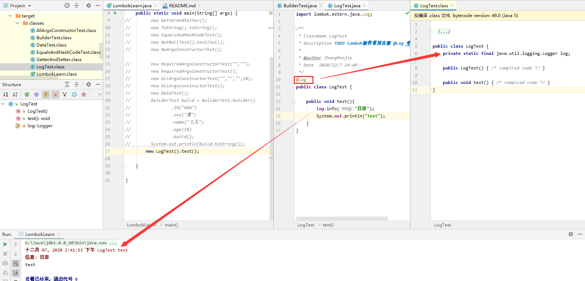

# 10. val
## 10.1 val 声明变量
跟 js 的 var 比较像，用 val 去声明变量。
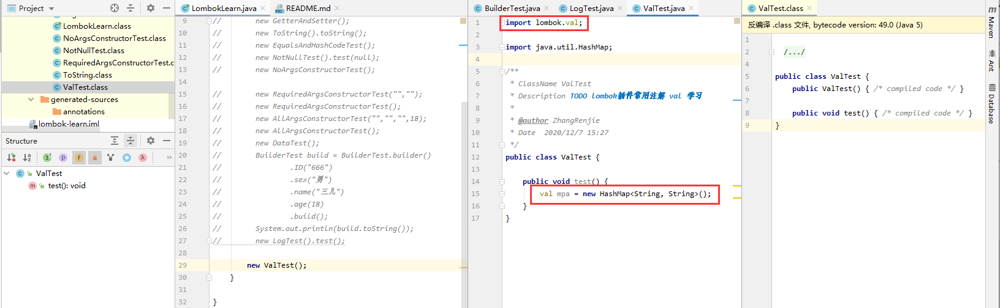

# 11. @Cleanup
## 11.1 代替资源管理
lombok 管理 IO 资源，不用每次都手动关闭了，lombok 会帮我们关闭
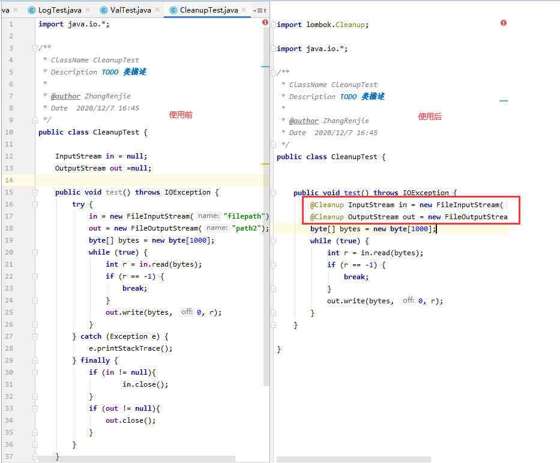
